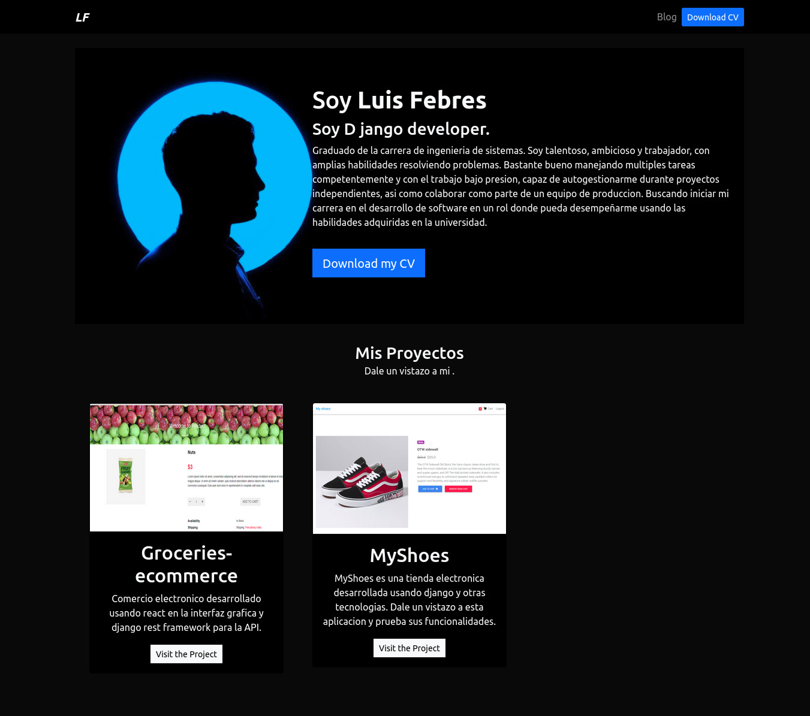

## Django Portofolio Example

Este es el protafolio basico.


### Instalacion

```
git clone https://github.com/luisfebres/djangoPortfolio.git
cd django-portfolio-simple
pip install -r requirements.txt
python manage.py runserver
```

Ahora solo debes visitar <a href="http://localhost:8000" target="_blank">http://localhost:8000</a>